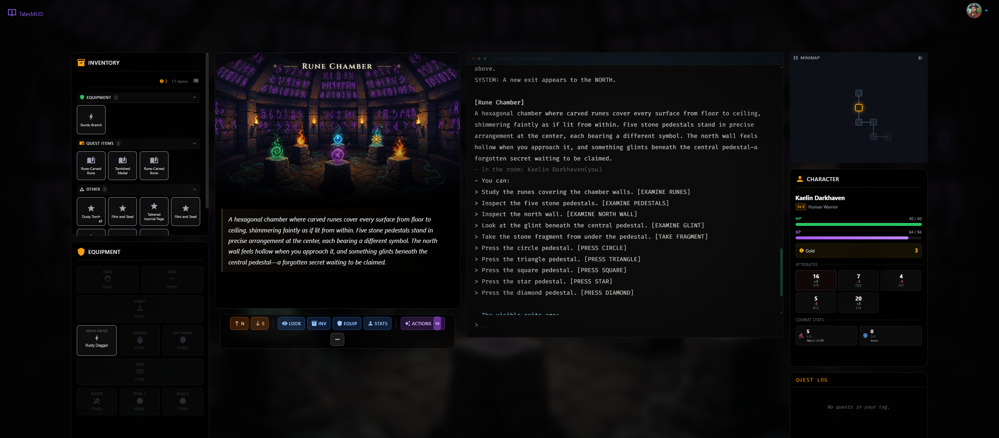
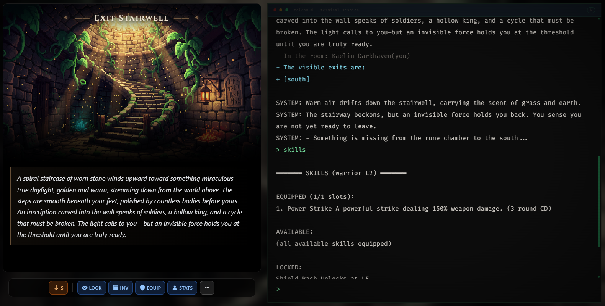

<div align="center">

# ⚔️ TalesMUD

### A Modern, Extensible MUD Framework for Web-Based RPGs

*Build immersive text-based multiplayer adventures in any genre — fantasy, sci-fi, horror, and beyond*

[](LICENSE)
[](https://golang.org/)
[](https://svelte.dev/)
[](https://veilspan.com)

[**Live Demo**](https://veilspan.com) • [**Documentation**](ARCHITECTURE.md) • [**Contributing**](#contributing) • [**Roadmap**](#roadmap)

</div>

---

## 📖 Overview

**TalesMUD** is a complete, production-ready framework for building browser-based Multi-User Dungeons (MUDs) — text-based multiplayer RPGs that run entirely in modern web browsers. Unlike traditional telnet-based MUDs, TalesMUD offers a rich, real-time web experience with persistent world state, live collaboration, and a powerful content creation suite.

Built with **Go** and **Svelte**, TalesMUD provides everything you need to launch your own multiplayer text adventure:

- ⚔️ **Full RPG Systems** — Combat, character progression, skills, quests, items, and loot
- 🗺️ **World Building Tools** — Visual editors for rooms, NPCs, dialogs, and interactive maps
- 🎨 **Genre-Agnostic Design** — Easily adapt for fantasy, sci-fi, horror, steampunk, or custom settings
- 🔧 **Lua Scripting** — Extend gameplay with custom mechanics, puzzles, and events
- 🌐 **Real-Time Multiplayer** — WebSocket-based gameplay with chat, emotes, and player presence
- 🎮 **Modern UX** — Rich terminal interface, graphical overlays, mobile-responsive design
- 🔐 **Auth0 Integration** — Secure authentication with OAuth2 and role-based access control

### 🎯 Live Demo

Experience TalesMUD in action at **[veilspan.com](https://veilspan.com)** — a small MVP adventure set in the **Veilspan Universe** on the fantasy world of **Aethermoor**. This demo showcases the framework's capabilities running a complete fantasy RPG.

---

## 📸 Screenshots

### In-Game Experience

*Explore richly described rooms with visual backgrounds, interactive terminals, and real-time multiplayer chat*

### Social & Multiplayer

*Engage in conversations with NPCs, collaborate with other players, and experience dynamic storytelling*

---

## ✨ Key Features

### 🎮 Complete RPG Framework

<table>
<tr>
<td width="50%" valign="top">

**Character System**
- 6 core classes (Warrior, Rogue, Ranger, Mage, Cleric, Druid)
- Multiple races with unique attributes
- Distributable stat points on level-up
- Equipment system with 10 slots
- Mana system for spellcasters
- Persistent character progression

</td>
<td width="50%" valign="top">

**Combat & Skills**
- Turn-based tactical combat
- 29+ skills/spells across classes
- Status effects (buffs, debuffs, DoTs, HoTs)
- Auto-attack with special abilities
- Skill cooldowns & resource management
- Loot tables with item rarities

</td>
</tr>
<tr>
<td width="50%" valign="top">

**Quest System**
- Multi-objective quests (Kill, Collect, Deliver, Talk, Visit)
- Quest prerequisites and level requirements
- Automatic progress tracking
- NPC dialog integration
- XP, gold, and item rewards
- Repeatable daily quests

</td>
<td width="50%" valign="top">

**World Building**
- Interconnected room-based world
- Visual backgrounds and mood settings
- Coordinate-based mapping (X, Y, Z grid)
- Dynamic NPC/item spawning
- Hidden exits and secret areas
- Custom room actions

</td>
</tr>
</table>

### 🛠️ Content Creation Suite

- **Web-Based Editor** — Full-featured CRUD interface for all game entities
- **Visual Map Editor** — Grid-based world map with room coordinates
- **Dialog Tree Builder** — Create branching NPC conversations with conditional logic
- **Lua Script IDE** — Syntax highlighting, test runner, and sandboxed execution
- **Live Preview** — Test changes instantly without server restarts
- **YAML Import/Export** — Version control friendly data formats

### 🎨 Genre Flexibility

TalesMUD's **generic, reusable architecture** makes it perfect for any setting:

- **Fantasy** — The included demo (Veilspan/Aethermoor) showcases medieval fantasy
- **Sci-Fi** — Space stations, alien worlds, cyberpunk cities
- **Horror** — Lovecraftian mysteries, survival horror, gothic tales
- **Modern** — Contemporary settings, spy thrillers, urban fantasy
- **Custom** — Mix genres or create entirely new worlds

**All core systems** (combat, quests, items, NPCs, dialogs) are **setting-neutral** and configurable through the content editor.

### 🚀 Modern Architecture

- **Go 1.24** backend with Gin HTTP framework
- **Svelte 4** frontend with TailwindCSS
- **SQLite** for persistence (simple deployment, no database server needed)
- **WebSocket** real-time communication
- **Docker** containerization for easy hosting
- **Auth0** OAuth2 authentication
- **Groq API** integration for AI-powered content generation

---

## 🚀 Quick Start

### Prerequisites

- **Go 1.24+** ([Download](https://golang.org/dl/))
- **Node.js 18+** ([Download](https://nodejs.org/))
- **Make** (optional, for convenience commands)

### Installation

```bash
# Clone the repository
git clone https://github.com/TalesMUD/talesmud.git
cd talesmud

# Build everything (backend + frontend)
make build

# Run the server
make run-server
```

The server will start on `http://localhost:8010`. Visit in your browser to begin!

### Docker Deployment

```bash
# Start with Docker Compose
docker-compose up -d
```

### Configuration

Create a `.env` file in the project root:

```bash
# Server
PORT=8010
GIN_MODE=debug
SQLITE_PATH=./talesmud.db

# Auth0 (optional, for authentication)
AUTH_ENABLED=false
AUTH0_DOMAIN=https://your-domain.auth0.com/
AUTH0_AUDIENCE=your-api-audience
AUTH0_WK_JWKS=https://your-domain.auth0.com/.well-known/jwks.json

# Admin (for export/import endpoints)
ADMIN_USER=admin
ADMIN_PASSWORD=admin

# Optional: AI character generation via Groq
GROQ_API_KEY=your-groq-api-key
```

See [Configuration](#configuration-reference) for full details.

---

## 🎯 Technology Stack

### Backend
| Component | Technology |
|-----------|------------|
| Language | Go 1.24 |
| HTTP Framework | Gin |
| WebSocket | Gorilla WebSocket |
| Database | SQLite (JSON document storage) |
| Scripting | Lua (gopher-lua) |
| Authentication | Auth0 JWT |
| AI Integration | Groq API |
| Logging | Logrus |

### Frontend
| Component | Technology |
|-----------|------------|
| Framework | Svelte 4.2 |
| Build Tool | Vite 6 |
| Styling | TailwindCSS 3.4 |
| Terminal | xterm.js |
| HTTP Client | Axios |
| Router | yrv |
| Flow Diagrams | xyflow |

### Infrastructure
| Component | Technology |
|-----------|------------|
| Container | Docker |
| Orchestration | Docker Compose |
| CI/CD | GitHub Actions |

---

## 📚 Core Concepts

### Architecture Overview

```
┌─────────────────────────────────────────────────────────────┐
│                    Web Browser Client                        │
│              (Svelte SPA + xterm.js Terminal)               │
└──────────────────────┬──────────────────────────────────────┘
                       │ WebSocket + REST API
                       ▼
┌─────────────────────────────────────────────────────────────┐
│                   Go Server (Gin)                            │
├──────────────────┬──────────────────┬───────────────────────┤
│  HTTP API        │  MUD Server      │  WebSocket Handler    │
│  (REST + Auth)   │  (Game Engine)   │  (Real-time Comms)    │
└──────────────────┴──────────────────┴───────────────────────┘
                       │
                       ▼
┌─────────────────────────────────────────────────────────────┐
│              Service Layer (Business Logic)                  │
│  Characters • Rooms • Items • NPCs • Quests • Dialogs       │
└──────────────────────────────────────────────────────────────┘
                       │
                       ▼
┌─────────────────────────────────────────────────────────────┐
│            Repository Layer (Data Access)                    │
│              Generic SQLite with JSON payloads              │
└──────────────────────────────────────────────────────────────┘
```

### Game Loop

The game engine runs a concurrent event loop processing:

- **Player Commands** — Movement, combat, item interactions
- **NPC Behaviors** — Idle chatter, patrol paths, combat AI
- **Combat Instances** — Turn-based battles with initiative tracking
- **Quest Tracking** — Automatic progress updates from game events
- **Room Updates** — Spawner checks, NPC respawns, state sync

### Message System

All game output is routed through a **message audience system**:

- `Origin` — To the command sender only
- `User` — To a specific user
- `Room` — To all players in a room
- `RoomWithoutOrigin` — To room except sender
- `Global` — Server-wide broadcast

---

## 🎮 Game Systems

### Combat

Turn-based combat with:
- Initiative rolls (1d20 + DEX modifier)
- Auto-attack each round
- Skills/spells with mana costs or cooldowns
- Defensive stance (+50% defense)
- Flee attempts (50% + DEX bonus)
- Status effects (stun, DoT, HoT, buffs, debuffs)
- XP and loot on victory

### Character Progression

- **Leveling** — Flattened XP curve (gentle L2-5, transitional L6-15, steeper L16+)
- **Distributable Stats** — 2 points per level to allocate freely
- **Class Caps** — Prevent degenerate builds (e.g., warriors cap INT at 5)
- **Exploration XP** — 5 XP per new room, 15 XP for new zones
- **Mana System** — Scales with level and INT for casters
- **Equipment** — Weapons, armor, accessories with stat bonuses

### Quests

Data-driven quest definitions with:
- Multiple objective types (Kill, Collect, Deliver, Visit, Talk, Custom Lua)
- Prerequisites (required quests, level)
- Rewards (XP, gold, items)
- Automatic progress tracking
- NPC dialog integration (offer/progress/turn-in)

### Items & Economy

- **Item Types** — Weapon, Armor, Consumable, Currency, Quest, Crafting Material
- **Quality Tiers** — Normal, Magic, Rare, Legendary, Mythic
- **Templates & Instances** — Reusable blueprints with unique instances
- **Merchants** — NPC traders with inventory, restock, price multipliers
- **Containers** — Nested items, lockable chests

### NPCs & Dialogs

- **Dialog Trees** — Branching conversations with options and prerequisites
- **Template System** — Spawn multiple instances from blueprints
- **Behavior Traits** — Enemy (combat stats, aggro, loot) and Merchant (trading)
- **AI States** — Idle, patrol, combat, fleeing, dead
- **Spawners** — Automatic respawn with intervals and caps

---

## 📖 Documentation

### Core Documentation
- **[ARCHITECTURE.md](ARCHITECTURE.md)** — System design, data flow, and component structure
- **[PROJECT.md](PROJECT.md)** — Feature list, configuration, and development status

### Design & Development
- **[docs/design/GAME_DESIGN.md](docs/design/GAME_DESIGN.md)** — Game design document and roadmap
- **[docs/design/SCRIPTING.md](docs/design/SCRIPTING.md)** — Lua scripting API and examples
- **[docs/design/QUEST_AUTHORING.md](docs/design/QUEST_AUTHORING.md)** — Quest creation guide
- **[docs/design/](docs/design/)** — Complete design documentation (PRDs, dialog system, world maps)
- **[docs/development/](docs/development/)** — Developer documentation (agents, combat balance)

### Player Guide
- **[docs/player-guide/](docs/player-guide/)** — Complete player documentation and tutorials

---

## 🤝 Contributing

We welcome contributions! TalesMUD is actively developed with ongoing work in the `master` branch.

### Development Workflow

1. **Fork the repository**
2. **Create a feature branch** from `master`
3. **Make your changes** following existing code patterns
4. **Test thoroughly** (use dialog sandbox for NPC-related changes)
5. **Submit a pull request** with a clear description

### Building from Source

```bash
# Install dependencies
go mod download
cd public/app && npm install

# Build backend
go build -o bin/tales cmd/tales/main.go

# Build frontend
cd public/app && npm run build

# Run development server
make run-server

# Run frontend dev server (with hot reload)
make run-frontend
```

### Code Structure

```
talesmud/
├── cmd/                    # Application entry points
│   ├── tales/              # Main server
│   └── combat_simulator/   # Combat testing CLI
├── pkg/                    # Go packages
│   ├── entities/           # Data models
│   ├── mudserver/          # Game server & engine
│   ├── server/             # HTTP API
│   ├── service/            # Business logic
│   ├── repository/         # Data access
│   └── scripts/            # Lua scripting engine
├── public/app/             # Svelte frontend
│   └── src/
│       ├── game/           # Game client
│       ├── creator/        # Content editor
│       └── onboarding/     # Player onboarding
├── zones/                  # World content (Markdown source)
├── data/                   # Exported world data (YAML)
└── docs/                   # Docusaurus documentation
```

---

## 🗺️ Roadmap

TalesMUD is under active development. Upcoming features include:

### Short Term
- [ ] Enhanced NPC AI with dynamic behavior trees
- [ ] Crafting and resource gathering systems
- [ ] Guild/clan management
- [ ] Player housing and customization
- [ ] Advanced combat mechanics (formations, combo attacks)

### Medium Term
- [ ] Multi-server clustering for scalability
- [ ] Redis state sharing for horizontal scaling
- [ ] Advanced AI content generation (rooms, quests, dialogs)
- [ ] Mobile native app (React Native or Flutter)
- [ ] Voice chat integration

### Long Term
- [ ] Modding API and plugin system
- [ ] Marketplace for community-created content
- [ ] Game master tools for live events
- [ ] Procedural world generation
- [ ] GraphQL API for third-party integrations

---

## 📜 License

TalesMUD is released under the **MIT License**. See [LICENSE](LICENSE) for details.

```
MIT License

Copyright (c) 2020 Marcus Koerner

Permission is hereby granted, free of charge, to any person obtaining a copy
of this software and associated documentation files (the "Software"), to deal
in the Software without restriction, including without limitation the rights
to use, copy, modify, merge, publish, distribute, sublicense, and/or sell
copies of the Software, and to permit persons to whom the Software is
furnished to do so, subject to the following conditions:
...
```

---

## 🌟 Showcase

### Current Deployments

- **[Veilspan MUD](https://veilspan.com)** — Fantasy adventure in the Veilspan Universe (official test deployment)

*Using TalesMUD for your project? [Open an issue](https://github.com/TalesMUD/talesmud/issues) to get listed here!*

---

## 💬 Community & Support

- **Issues** — [GitHub Issue Tracker](https://github.com/TalesMUD/talesmud/issues)
- **Discussions** — [GitHub Discussions](https://github.com/TalesMUD/talesmud/discussions)
- **Live Demo** — [veilspan.com](https://veilspan.com)

---

## 🙏 Acknowledgments

TalesMUD builds on the shoulders of giants:

- **[MUD History](https://en.wikipedia.org/wiki/MUD)** — Inspired by decades of text-based virtual worlds
- **[gopher-lua](https://github.com/yuin/gopher-lua)** — Lua VM for Go
- **[xterm.js](https://xtermjs.org/)** — Terminal emulator for the web
- **[Svelte](https://svelte.dev/)** — Cybernetically enhanced web apps
- **[Gin](https://gin-gonic.com/)** — High-performance Go HTTP framework

---

<div align="center">

**Built with ❤️ by the TalesMUD community**

*Start your adventure today at [veilspan.com](https://veilspan.com)*

</div>
