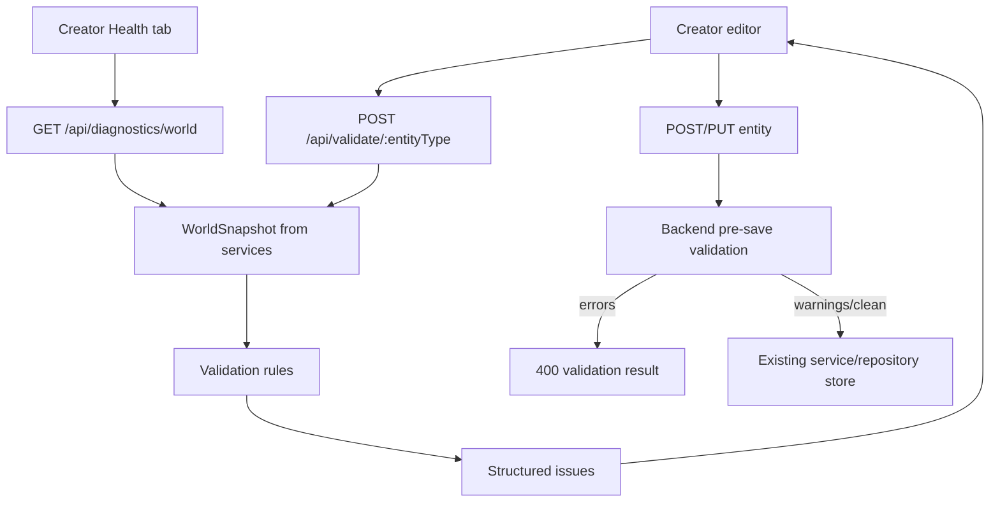

# Creator Quality Layer Design

## Goal

Make the Creator safer for real content authoring by detecting invalid content before it enters the world, surfacing broken references inline while editing, and providing world-wide diagnostics and preview/test tools for high-risk authoring workflows.

## Current State

The project already has broad Creator coverage for rooms, item templates, character templates, NPCs, dialogs, quests, skills, scripts, world editing, and settings. The UI uses `EntitySelectButton` plus `EntitySelectModal` for most entity ID references, and documentation states this is mandatory for scalable entity selection.

The backend has validation logic in `pkg/importer/validator.go`, but that logic is tied to YAML import models and emits log-style warning strings. Live REST CRUD handlers currently accept entities with broken cross-entity references, so bad rooms, quests, NPCs, dialogs, loot tables, scripts, or merchant stock can be saved through the Creator.

The frontend has a Lua script test runner in `ScriptsEditor.svelte`, but there is no shared validation API, no consistent inline validation surface, and no world health page that explains broken references across the whole content set.

## Scope

This design covers:

- Shared backend validation rules for rooms, quests, NPCs, dialogs, loot tables, items, scripts, and NPC spawners where they affect the requested systems.
- Broken-reference detection before save and through a world health diagnostics endpoint.
- Frontend inline validation across primary Creator editors.
- Broken-reference warnings in detail panels and table rows.
- Preview/test affordances for dialogs, scripts, quests, rooms, and merchants.
- Verification that entity ID selectors use `EntitySelectButton` rather than simple `<select>` dropdowns.
- Documentation updates in `PROJECT.md`, `ARCHITECTURE.md`, and `FEATURES.md`.

This design does not add a separate publishing workflow. In this project, "before saving/publishing" means content is validated before Creator CRUD saves, and world-level health diagnostics provide the publish/readiness signal.

## Backend Architecture

Add a validation package under `pkg/service/validation` with these responsibilities:

- Define structured issue types.
- Build a live `WorldSnapshot` from existing services.
- Validate a single draft entity against the live snapshot.
- Validate the full world for diagnostics.
- Reuse Lua static checks currently embedded in the importer.

Core types:

```go
type Severity string

const (
    SeverityError   Severity = "error"
    SeverityWarning Severity = "warning"
)

type Issue struct {
    Severity   Severity `json:"severity"`
    Code       string   `json:"code"`
    EntityType string   `json:"entityType"`
    EntityID   string   `json:"entityId,omitempty"`
    Field      string   `json:"field,omitempty"`
    RefType    string   `json:"refType,omitempty"`
    RefID      string   `json:"refId,omitempty"`
    Message    string   `json:"message"`
}

type Result struct {
    Valid    bool    `json:"valid"`
    Errors   int     `json:"errors"`
    Warnings int     `json:"warnings"`
    Issues   []Issue `json:"issues"`
}
```

`Valid` is true only when there are no `error` issues. Warnings do not block saves.

`WorldSnapshot` includes maps keyed by ID for:

- Rooms
- Items and item templates
- NPCs and NPC templates
- Dialogs
- Loot tables
- NPC spawners
- Quests
- Scripts

The snapshot builder uses the existing `service.Facade` so routes and handlers do not duplicate repository loading logic.

## Validation Rules

### Rooms

Errors:

- Exit target references a missing room.
- `onEnterScriptID` references a missing script.
- Room action with `type: "script"` references a missing script.
- Room item ID references a missing item/template.
- Room resident NPC ID references a missing NPC.

Warnings:

- Exit has a target but no name.
- Action has `type: "script"` but no `scriptId`.
- Exit points back to the same room unless its type is `teleport`.

### NPCs and Merchants

Errors:

- `spawnRoomId` or `currentRoomID` references a missing room.
- `dialogID` or `idleDialogID` references a missing dialog.
- `enemyTrait.lootTableId` references a missing loot table.
- Enemy event script IDs reference missing scripts.
- Merchant inventory `itemTemplateId` references a missing item/template.
- `templateId` on an NPC instance references a missing NPC template.
- Patrol path entries reference missing rooms.
- Enemy trait `guaranteedLoot` entries reference missing item templates. Runtime loot generation consumes this field directly.

Warnings:

- Merchant inventory has negative quantity other than `-1`.
- Merchant inventory has `maxQuantity` below current finite quantity.

### Dialogs

Errors:

- Duplicate node IDs within a dialog tree.
- Option/answer references a missing node when represented as a node reference.
- `questId` references a missing quest.

Warnings:

- Root dialog has no `nodeId` and no obvious `main` node.
- Dialog option has neither text nor answer/next node.
- Mustache placeholders use reserved Creator validation names incorrectly.

### Quests

Errors:

- Source NPC references a missing NPC.
- Source item references a missing item/template.
- `onCompleteScriptId` references a missing script.
- Required quest IDs reference missing quests.
- Objective script IDs reference missing scripts.
- Objective target IDs reference missing entities based on objective type:
  - `kill`: NPC/template
  - `collect`: item/template
  - `deliver`: item/template plus `deliverToNpcId`
  - `visit`: room
  - `talk`: NPC/template, and `dialogNodeId` when the quest source NPC has a dialog attached
- Reward item template IDs reference missing items/templates.

Warnings:

- Objective has no stable ID.
- Objective amount is less than 1 for objective types that need counts.
- Quest source type is unknown.

### Loot Tables

Errors:

- Entry `itemTemplateId` references a missing item/template.
- Drop chance is outside `0.0` to `1.0`.
- `minQuantity` is greater than `maxQuantity`.

Warnings:

- Empty loot table attached to an enemy.
- Non-guaranteed entry has `dropChance` of `0`.

### Items

Errors:

- `onUseScriptID` references a missing script.
- `templateId` on an instance references a missing item template.
- Container child item IDs reference missing items where persistent nested IDs are used.

Warnings:

- Consumable item has no built-in effect and no use script.
- Stackable item has invalid max stack or quantity.

### NPC Spawners

Errors:

- `templateId` references a missing NPC template.
- `roomId` references a missing room.

Warnings:

- Spawner uses a non-template NPC as its template.

### Scripts

Errors:

- Non-Lua script is saved through the Lua-only Creator path.
- Lua parse/runtime smoke test fails in a static validation context where compilation can be checked safely.

Warnings:

- Unknown `tales.game.*` API call.
- Known `tales.game.*` API call with the wrong argument count.
- Room/on-enter script uses `ctx.roomID` instead of `ctx.room.ID`.

Move the existing importer Lua static checks into a reusable function that returns structured issues. The importer adapts those issues back into its current warning log output.

## API Design

Add Creator-only endpoints:

```text
GET  /api/diagnostics/world
POST /api/validate/:entityType
POST /api/preview/dialog
POST /api/preview/quest
POST /api/preview/room
POST /api/preview/merchant
```

`GET /api/diagnostics/world` returns full-world `Result` plus issue counts grouped by entity type.

`POST /api/validate/:entityType` validates a draft entity against the current live world snapshot. The request body is the entity JSON. The route supports `room`, `npc`, `dialog`, `quest`, `loottable`, `item`, `script`, and `spawner`.

Save behavior:

- `POST` and `PUT` handlers for rooms, NPCs, dialogs, quests, loot tables, items, scripts, and spawners call the validation service before storing.
- If validation has errors, return `400` with the structured validation result and do not save.
- If validation has warnings only, save normally and return the saved entity or status plus validation warnings.

Preview behavior:

- Dialog preview renders the root/current node text and available options without mutating game state.
- Quest preview returns source summary, objective summary, reward summary, and validation issues.
- Room preview returns exits, actions, resident NPC names, item names, and validation issues.
- Merchant preview returns stock rows with item names, computed buy prices, finite/unlimited stock labels, and validation issues.
- Script testing continues to use `POST /api/run-script/:id`; add validation to script save and show static warnings beside runtime test output.

## Frontend Architecture

Add:

- `public/app/src/api/validation.js`
- `public/app/src/api/previews.js`
- `public/app/src/creator/ValidationPanel.svelte`
- `public/app/src/creator/WorldHealth.svelte`
- Focused preview modals for dialogs, quests, rooms, and merchants. The project already uses modal components for secondary Creator workflows, so previews follow that pattern instead of adding a persistent panel to every editor.

Extend `CRUDEditor.svelte`:

- Accept optional `config.entityType`.
- Run validation for `config.entityType` when a selected entity changes, debounced.
- Run validation before `create` and `update`.
- Disable save only when there are `error` issues; warnings remain visible but non-blocking.
- Display save-time backend validation errors even if inline validation missed them.
- Expose `config.getPreview` and `config.previewLabel` for editor-specific preview/test buttons.

Add a Creator "Health" tab:

- Shows world validity summary.
- Groups issues by severity and entity type.
- Lets creators filter by entity type, severity, and text.
- Links or navigates to the relevant Creator editor when possible.

Inline warning behavior:

- `ValidationPanel` shows errors first, then warnings.
- Fields with known `field` paths display short warning text near the relevant editor controls for the editors touched by this work.
- Data tables receive `rowIndicator` data for rows that have health issues.
- Broken references include the missing ID and the field path.

Preview/test buttons:

- Scripts: keep "Run Test" and add static validation output in the same editor.
- Dialogs: add "Preview Dialog" to render the selected node/tree path.
- Quests: add "Preview Quest" to summarize acquisition, objectives, rewards, and validation.
- Rooms: add "Preview Room" to summarize player-facing room text, exits, actions, NPCs, and items.
- Merchants: add "Preview Merchant" in the NPC editor when `merchantTrait` exists.

Entity selector rule:

- Run an audit for simple `<select>` controls in Creator components.
- Keep `<select>` only for enum/filter choices such as type, quality, race/class, difficulty, table filters, area filters, and z-level filters.
- Replace any remaining entity ID reference `<select>` with `EntitySelectButton` and appropriate columns from `tableColumns.js`.

## Data Flow



## Error Handling

- Validation endpoint failures show a non-blocking UI message and never imply the entity is safe.
- Save endpoint validation errors are authoritative and block saving.
- Missing optional references with empty strings are ignored.
- Unknown entity types return `400`.
- Snapshot load failures return `500` with a plain error message; the frontend shows diagnostics as unavailable.

## Testing Strategy

Backend tests:

- Unit tests for each validator group using in-memory snapshots.
- Tests that a broken room exit, quest reward, NPC merchant stock item, dialog quest link, loot entry, item use script, spawner template, and script API misuse produce structured issues.
- Handler tests proving `POST/PUT` rejects error-level validation issues and allows warning-only issues.
- Importer tests or existing importer validation tests adjusted so importer behavior remains intact after Lua static checks move to shared validation.

Frontend verification:

- `npm run build` in `public/app`.
- Manual or Playwright smoke coverage for Health tab rendering, inline validation rendering, blocked save response display, and preview buttons.
- `rg` audit proving entity ID references do not use simple `<select>` dropdowns.

Project verification:

- `go test ./...`
- `PROJECT.md`, `ARCHITECTURE.md`, and `FEATURES.md` updated to describe the validation service, diagnostics endpoints, Creator health tab, inline validation, and preview/test tools.

## Rollout Plan

1. Extract shared validation types and Lua static checks with tests.
2. Add live `WorldSnapshot` loading and full-world diagnostics.
3. Add single-entity validation endpoint.
4. Gate backend saves for validated entity handlers.
5. Add frontend validation API and `ValidationPanel`.
6. Wire inline validation into primary Creator editors through `CRUDEditor`.
7. Add Health tab and table row indicators.
8. Add preview/test tools for dialogs, quests, rooms, merchants, and script static warnings.
9. Audit entity selectors.
10. Update docs and run verification.

## Design Decisions

- Warnings versus errors stay conservative: broken references are errors; authoring quality smells are warnings.
- Dialog preview uses safe rendering only. It does not execute scripts or mutate quest state.
- Quest and room previews summarize authoring data. They do not simulate full game state.
- The validation result schema is intentionally stable so later publishing gates can reuse it.
